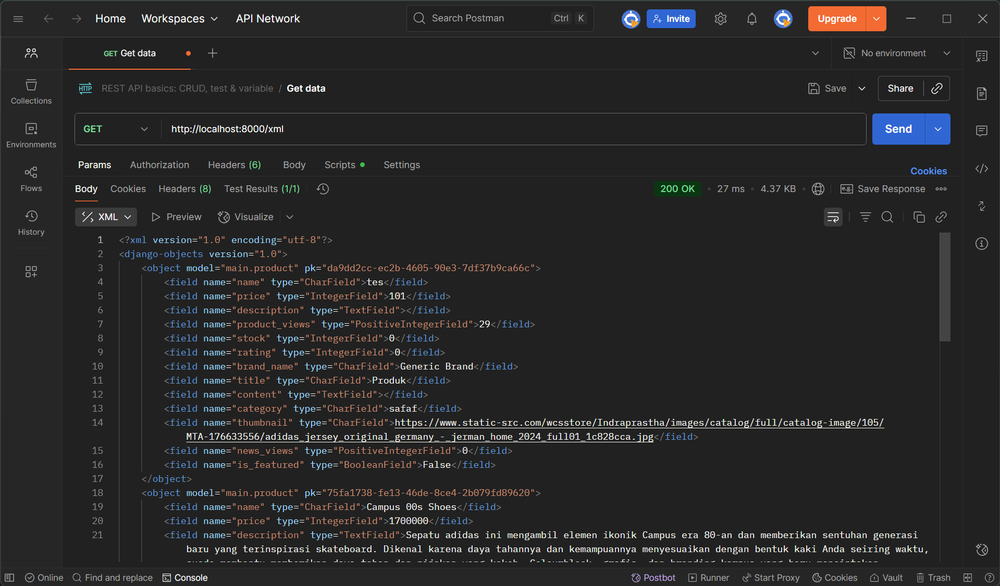
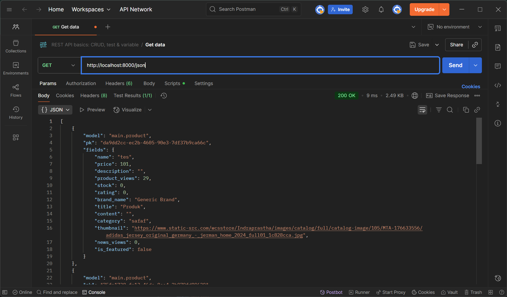
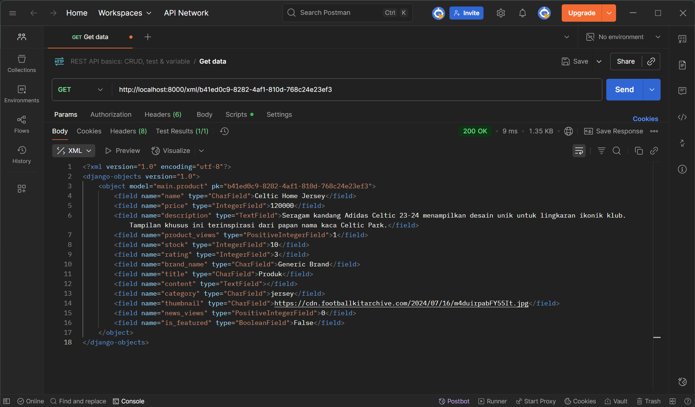
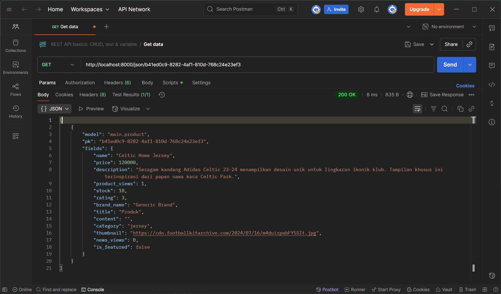
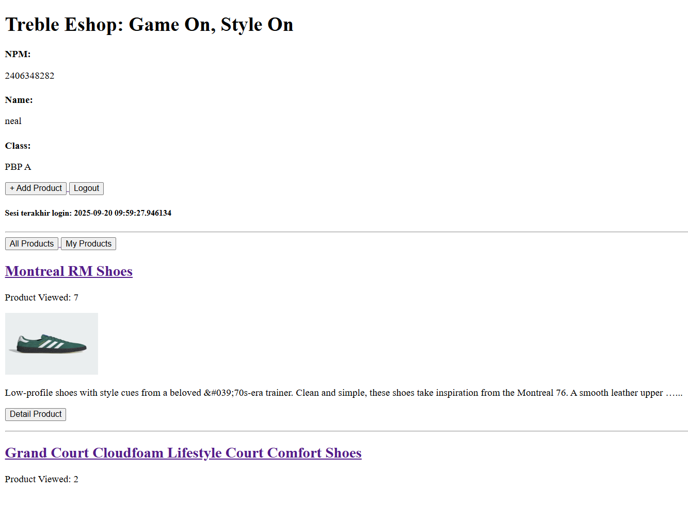
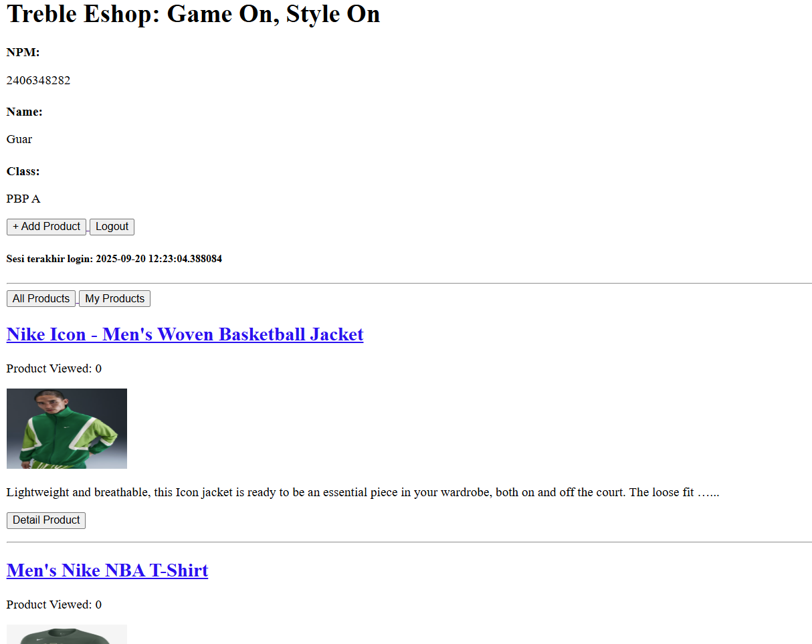

Link PWS Tugas 2:\
https://neal-guarddin-trebleeshop.pbp.cs.ui.ac.id/ \
Link Github Tugas 2:\
https://github.com/CerebrumCoder/treble-eshop


**Tugas 2: 8 September 2025**

Jawaban pertanyaan:
1. Jelaskan bagaimana cara kamu mengimplementasikan checklist di atas secara step-by-step (bukan hanya sekadar mengikuti tutorial)!\
Secara garis besar, step-by-step implementasinya mirip prosedur dari tutorial. Mulai dari tutorial 0 sampai tutorial 1. Akan tetapi, banyak perubahan yang dilakukan agar sesuai dengan kebutuhan proyek ini, seperti nama direktori utama, SCHEMA di-set menjadi tugas_individu, pembuatan models.py, selalu mengubah dan menambah baris kode models.py dengan bantuan makemigrations serta migrate, dan pembuatan unit test. Contoh lainnya, membuat model pada aplikasi main dengan nama Product dan ada atribut wajibnya serta method yang diperlukan. Otomatis dalam pembuatan Unit Test juga menyesuaikan dengan yang sudah didefinisikan pada class Product. Serta setiap adanya perubahan pada models.py, perlu memanggil command makemigrations dan migrate untuk memberitahu perubahan kepada Django. Hal ini dapat dilihat perubahan signifikannya pada models.py, tests.py, .env.prod.

2. Buatlah bagan yang berisi request client ke web aplikasi berbasis Django beserta responnya dan jelaskan pada bagan tersebut kaitan antara urls.py, views.py, models.py, dan berkas html\


3. Jelaskan peran settings.py dalam proyek Django!\
settings.py dalam Django memegang peran krusial sebagai pusat kendali utama dalam sebuah proyek. Anggap sebagai "otak" dari web aplikasi kita.
Pada intinya settings.py adalah sebuah "buku instruksi" yang memberi tahu Django semua yang perlu dia ketahui supaya dapat berjalan dengan benar.
Tanpa file ini, kita tidak akan tahu:
    - Database mana yang harus digunakan
    - Aplikasi mana saja yang menjadi bagian dari proyek
    - Cara mengamankan aplikasi dengan SECRET_KEY dan ALLOWED_HOSTS
    - Cara menangani file statis Template seperti CSS dan JavaScript
    - Apakah proyek web aplikasi sedang berjalan dalam mode pengembangan (banyak info error ketika DEBUG diset jadi TRUE) atau mode produksi (terkunci dan efisien)

4. Bagaimana cara kerja migrasi database di Django?\
Secara sederhana, migrasi Django kerjanya mirip version control system (Git) untuk struktur database kita. Proses ini memastikan bahwa perubahan pada kode model (models.py) tercermin secara aman dan konsisten di dalam database yang sebenarnya. Analoginya seperti membangun rumah dengan arsitek dan tim konstruksi:
    - Arsitek (Kita dan makemigrations): Merancang cetak biru (blueprint) perubahan
    - Tim konstruksi (migrate): membaca cetak biru dan membangun atau mengubah struktur fisik bangunan

    Proses migrate melibatkan 3 komponen utama: kode kita (models.py), file migrasi (di dalam folder migrations/), dan tabel khusus di database kita bernama django_migrations.

    **Langkah 1: Kita mengubah models.py**\
    Kita membuka file models.py di web aplikasi dan melakukan perubahan/ Contohnya nambah line baris baru dalam models.py. Saat ini database kita belum berubah sama sekali. Kode python dan struktur database tidak sinkron.

    **Langkah 2: Kita menjalankan "python manage.py makemigrations"**\
    Django melakukan hal ini ketika command makemigrations dipanggil"
    1. Memeriksa perbedaan: Django membandingkan keadaan models.py saat ini dengan catatan file migrasi terakhir yang dibuat
    2. Mendeteksi perubahan: ternyata class di dalam models.py ada perubahan nambah baris kode nih
    3. Membuat cetak biru/blueprint: Django kemudian membuat sebuah file Python baru di dalam folder migrations/ web aplikasi. File ini bukan kode SQL. Tapi representasi perubahan dalam Python yang bersifat database-agnostik \

    **Langkah 3: Kita menjalankan "python manage.py migrate"**\
    Ketika ini dijalankan, Django melakukan tugas-tugas penting berikut:
    1. Django melihat dalam database kita dan memeriksa apakah ada perubahan atau tidak
    2. Membandingkan catatan: Django membandingkan catatan perubahan sebelum dan sesudah
    3. Menemukan migrasi baru: ketemu bahwa kode dalam file models.py ada perubahan. Berarti migrasi tersebut belum diterapkan
    4. Menerjemahkan ke SQL: Django membaca instruksi dari file migrasi dan menerjemahkannya ke dalam bahasa SQL yang sesuai dengan database yang kita gunakan (misalnya, PostgreSQL, MySQL, atau SQLite) 
    5. Eksekusi Perintah SQL: Django menjalankan perintah SQL tersebut pada database kita. Sekarang, struktur tabel di dalam model database kita benar-benar diubah
    6. Mencatat Pekerjaan Selesai ✅: Setelah berhasil, Django menambahkan satu baris baru ke tabel django_migrations yang mencatat bahwa migrasi tambahan baris kode telah berhasil diterapkan. Ini sangat penting untuk memastikan Django tidak mencoba menjalankan migrasi yang sama dua kali.

5. Menurut Anda, dari semua framework yang ada, mengapa framework Django dijadikan permulaan pembelajaran pengembangan perangkat lunak?\
Karena Django memiliki filosofi "Batteries-Included" (semua sudah termasuk). Artinya Django datang sebagai paket lengkap yang menyediakan hampir semua alat yang dibutuhkan seorang developer untuk membangun aplikasi web yang kompleks dari awal hingga akhir. Bagi pemula, ini sangat berharga karena mengurangi kebingungan dan memungkinkan mereka pada fokus pada konsep-konsep inti pengembangan. Meskipun ada framework lain yang mungkin lebih "ringan" atau "fleksibel", Django unggul sebagai platform pembelajaran karena ia bertindak sebagai guru yang terstruktur. Ia tidak hanya memberi alat, tetapi juga mengajarkan cara membangun aplikasi yang aman, terukur, dan terorganisir dengan baik.\
Bagi seorang pemula, Django mengurangi beban kognitif dan menyediakan jalur yang jelas dari "tidak tahu apa-apa" menjadi "mampu membangun aplikasi web yang fungsional," menjadikannya fondasi yang sangat kokoh untuk karir di bidang pengembangan perangkat lunak


6. Apakah ada feedback untuk asisten dosen tutorial 1 yang telah kamu kerjakan sebelumnya? \
Tidak ada saya bisa memahami penjelasan Django dengan baik. Akhirnya tidak perlu melihat ke sumber lain karena cukup dari website PBP bisa mengerti sepenuhnya.


**Tugas 3: 13 September 2025**
1. Jelaskan mengapa kita memerlukan data delivery dalam pengimplementasian sebuah platform? \
Data delivery adalah cara backend “mengemas & mengirim” data ke pemakai (web, mobile, service lain) dengan format, performa, dan jaminan yang tepat. 
    - Alasannya karena pemisahan tanggung jawab (decoupling). Frontend tidak langsung ke database. Data disajikan lewat kontrak stabil (HTML/JSON/GraphQL) sehingga UI bisa berkembang tanpa mengubah skema DB terus-terusan
    - Keamanan & kontrol akses. Validasi, autentikasi, otorisasi, rate limit, dan audit log dilakukan di lapisan delivery, bukan di UI atau DB
    - Performa & skalabilitas. Pagination, filtering, shaping payload, caching, kompresi, dan CDN menurunkan beban DB & latensi

2. Menurutmu, mana yang lebih baik antara XML dan JSON? Mengapa JSON lebih populer dibandingkan XML? \
JSON lebih baik. Hal ini dikarenakan ergonomis untuk developer, ringkas & cepat, ekosistem API modern, lebih mudah di-browser dan mobile. Integrasi di frontend simpel, di backend juga generik. Biasanya lebih aman “by default”. Parser JSON jarang kena penyakit klasik XML yaitu XXE.

3. Jelaskan fungsi dari method is_valid() pada form Django dan mengapa kita membutuhkan method tersebut? \
Method is_valid() adalah method yang seperti "cek data". Ketika dipanggil, maka Django akan memeriksa semua input, mengonversi ke tipe Python yang benar, dan menyiapkan error kalau ada salah. Kita membutuhkan method tersebut karena lebih aman, nyaman bagi developer dalam membuat web aplikasinya, dan pesan error otomatis muncul (sehingga mudah debug untuk menyelesaikan masalahnya).

4. Mengapa kita membutuhkan csrf_token saat membuat form di Django? Apa yang dapat terjadi jika kita tidak menambahkan csrf_token pada form Django? Bagaimana hal tersebut dapat dimanfaatkan oleh penyerang? \
Karena csrf_token itu mirip pelindung atau tanda pengenal sekali pakai yang membuktikan: “request ini benar-benar berasal dari form/halaman yang kamu kirim dari sitemu sendiri, bukan dari situs orang lain". Yang terjadi jika tidak menambahkan csrf_token adalah form tidak akan jalan dan web menjadi rawan dibajak sehingga mudah dieksploitasi.\
Skenario klasik penyerang memanfaatkan celah ini yaitu:
    1. User lagi login di situs yang kita buat (cookie sesi masih aktif).
    2. User iseng buka situs lain (mis. blog/iklan) yang ternyata dibuat penyerang.
    3. Di halaman itu, penyerang nyuruh browser user ngirim request ke situs yang kita buat. Contohnya transfer atau/mengubah email tanpa sepengetahuan user (bisa lewat form yang otomatis ke-submit dlsb.).
    4. Browser otomatis bawa cookie login user saat nyentuh domain situs yang kita buat.

    Kalau **TIDAK** ada csrf_token:
Server mengira request itu asli dari situsmu, karena cookie valid → aksi berbahaya jalan (email berubah, uang terkirim, data kehapus), padahal korban nggak pernah klik apa-apa.

    Kalau **ADA** csrf_token:
Request dari halaman penyerang nggak punya token rahasia yang benar (mereka nggak bisa bacanya karena Same-Origin Policy) → server nolak (403). Aksi jahat gagal.

    Contoh sehari-hari yang fatal adalah Media sosial yang auto follow/like/post.
Lagi login di sosmed, tiba-tiba buka halaman jebakan.
Tanpa CSRF: akun kita bisa otomatis follow akun tertentu atau kirim status spam.
Dengan CSRF: server nolak karena tidak ada token yang sah.

5. Jelaskan bagaimana cara kamu mengimplementasikan checklist di atas secara step-by-step (bukan hanya sekadar mengikuti tutorial).\
Secara garis besar, step-by-step implementasinya mirip prosedur dari tutorial. Akan tetapi, banyak perubahan yang dilakukan agar sesuai dengan kebutuhan proyek ini, seperti pembuatan models.py sesuai atribut yang diminta dalam tugas, membuat forms.py untuk input data, membuat views.py untuk menampilkan dan menambahkan produk, membuat create_product.html, product_detail.html, dan base.html, serta menambahkan URL Routing di dalam main/urls.py dengan method yang sudah dibuat dalam views.py. 

6. Apakah ada feedback untuk asdos di tutorial 2 yang sudah kalian kerjakan? \
Tidak ada saya bisa memahami penjelasan Django dengan baik. Akhirnya tidak perlu melihat ke sumber lain karena cukup dari website PBP bisa mengerti sepenuhnya.

Hasil mengakses 4 URL untuk melihat data via XML dan JSON:
- **Semua Data Produk via XML**


- **Semua Data Produk via JSON**


- **Ambil Data Produk berdasarkan ID XML**


- **Ambil Data Produk berdasarkan ID JSON**
  


**Tugas 4: 18 September 2025**
1. Apa itu Django AuthenticationForm? Jelaskan juga kelebihan dan kekurangannya.\
**Django AuthenticationForm** adalah class fitur bawaan dari Django yang menyediakan sistem formulir untuk authentikasi pengguna/user seperti login dan registrasi.

    Kelebihan Django AuthenticationForm:
    - **Mudah digunakan**. Django Authentication Form sangat mudah diintegrasikan ke dalam proyek Django. Kita hanya perlu mengimpornya dan menggunakannya dalam tampilan (view) dan template proyek
    - **Keamanan terjamin**. Django dibangun dengan mempertimbangkan keamanan. AuthenticationForm secara otomatis bisa menangani banyak aspek keamanan, contohnya perlindungan terhadap serangan Cross-Site Request Forgery (CSRF) dan hashing kata sandi yang aman
    - **Tersedia fitur otomatis**. Formulir ini sudah menyediakan validasi otomatis untuk input pengguna, seperti memeriksa apakah username dan password sudah diisi

    Kekurangan Django AuthenticationForm:
    - **Kurang Fleksibel untuk Kebutuhan Spesifik**. Kalo kita membutuhkan authentikasi yang lebih spesifik atau kompleks, maka Django AuthenticationForm kurang fleksibel untuk hal itu.
    - **Terlalu Banyak Fitur yang Tidak Dibutuhkan**. Untuk aplikasi yang sangat sederhana dan hanya membutuhkan authentikasi dasar, fitur-fitur lengkap dari AuthenticationForm mungkin terasa berlebihan dan menambahkan kompleksitas yang tidak perlu
    - **Membutuhkan Pemahaman Dasar Django**. Meskipun mudah digunakan, kita tetap perlu memiliki pemahaman dasar tentang cara kerja Django, termasuk views, forms, dan templates, untuk bisa menggunakannya dengan efektif

2. Apa perbedaan antara autentikasi dan otorisasi? Bagaimana Django mengimplementasikan kedua konsep tersebut?\
    **Authentikasi** adalah proses verifikasi identitas pengguna. Contohnya, memasukkan username dan password untuk login ke sebuah situs web, menggunakan sidik jari atau PIN untuk membuka smartphone, atau memindai scan wajah untuk verifikasi identitas. Tujuannya untuk memastikan bahwa pengguna yang mencoba mengakses sistem adalah pengguna yang sah dan terdaftar. Jika autentikasi berhasil, sistem tahu siapa pengguna tersebut

    **Otorisasi** adalah proses menentukan hak akses atau izin yang dimiliki oleh pengguna yang sudah terautentikasi terhadap sumber daya tertentu. Contohnya, seorang pengguna admin dapat menghapus data pengguna lain, sementara pengguna biasa hanya dapat melihat dan mengedit profilnya sendiri. Tujuannya untuk mengontrol akses ke fitur, data, atau fungsi berdasarkan peran atau izin yang diberikan kepada pengguna

    Cara implementasinya yaitu:
    1. **User Model**\
    Django memiliki model User bawaan (django.contrib.auth.models.User) yang menyimpan informasi dasar pengguna seperti username, password (yang di-hash dengan aman), email, first name, last name, dan status aktif.
    2. **Authentication Backends**\
    Django mendukung multiple authentication backends. Ini berarti kita bisa mengautentikasi pengguna engga hanya berdasarkan username dan password, tetapi juga melalui metode lain (misalnya, email dan password, atau integrasi dengan LDAP/OAuth melalui third-party apps).
    3. **Authentication Forms & Views**\
    Django menyediakan AuthenticationForm (seperti yang dijelaskan sebelumnya) dan views siap pakai (LoginView, LogoutView) yang memudahkan kita untuk membuat fungsionalitas login dan logout tanpa harus menulis banyak kode
    4. **Password Hashing**\
    Django secara otomatis meng-hash password menggunakan algoritma yang kuat (seperti PBKDF2) untuk melindungi data dari serangan
    5. **Session Management**\
    Setelah pengguna berhasil terautentikasi, Django membuat session yang menyimpan informasi bahwa pengguna tersebut sudah login. Session ini kemudian digunakan untuk melacak pengguna di setiap permintaan berikutnya tanpa perlu autentikasi ulang


3. Apa saja kelebihan dan kekurangan session dan cookies dalam konteks menyimpan state di aplikasi web?\
    Kelebihan cookies:
    - **Statelessness Ditingkatkan**: Memungkinkan server untuk tetap stateless karena semua data yang diperlukan untuk mengidentifikasi atau mengautentikasi pengguna dikirimkan kembali oleh browser di setiap permintaan.
    - **Skalabilitas**: Karena data disimpan di sisi klien, ini dapat mengurangi beban pada server, yang membantu skalabilitas aplikasi.
    - **Dapat Digunakan untuk Personalisasi**: Sangat baik untuk menyimpan preferensi pengguna (misalnya, tema, bahasa, pengaturan tampilan) yang tidak perlu diakses oleh server setiap saat.
    - **Dapat Ditetapkan Expiry Date**: Cookies dapat memiliki expiry date (tanggal kadaluarsa), sehingga bisa tetap ada di browser pengguna bahkan setelah browser ditutup

    Kekurangan cookies:
    - **Ukuran terbatas**: Ukuran setiap cookie umumnya sangat kecil (sekitar 4KB), dan jumlah cookies per domain juga terbatas. Ini tidak cocok untuk menyimpan data yang besar
    - **Keamanan (Client-Side Storage)**: Data yang disimpan di cookies (terutama yang tidak terenkripsi) rentan terhadap inspeksi dan manipulasi oleh pengguna. 
    - **Mengirim Data di Setiap Permintaan**: Setiap kali browser membuat permintaan ke server yang cookienya berlaku, cookie tersebut akan dikirimkan. Jika ada banyak cookies atau cookies berukuran besar, ini bisa menambah overhead pada setiap permintaan dan memengaruhi kinerja

    Kelebihan session:
    - **Keamanan Lebih Baik (Server-Side Storage)**: Data session yang sebenarnya disimpan di server, sehingga tidak bisa diakses atau dimanipulasi langsung oleh pengguna di browser. Ini ideal untuk menyimpan data rahasia dan sensitif
    - **Ukuran Data Tidak Terbatas**:
    Tidak ada batasan ukuran data session selain kapasitas penyimpanan server kita
    - **Tidak Dikirim di Setiap Permintaan**: Hanya Session ID (yang ukurannya kecil) yang dikirim di setiap permintaan HTTP, bukan seluruh data session
    - **Manajemen Mudah**: Server dapat dengan mudah mengelola dan mengakhiri session (misalnya, setelah timeout atau logout)

    Kekurangan session:
    - **Beban Server**: Data session disimpan di server, yang berarti server harus mengelola dan menyimpan data untuk setiap pengguna aktif. Ini dapat meningkatkan penggunaan memori dan storage server, terutama pada aplikasi dengan banyak pengguna bersamaan
    - **Masalah Skalabilitas (Horizontal Scaling)**: Jika kita menjalankan beberapa instance server (misalnya, di balik load balancer), session yang disimpan secara lokal di satu server tidak akan tersedia di server lain.
    - **SPOF (Single Point of Failure)**: Jika session storage utama mengalami masalah, semua session bisa hilang atau tidak dapat diakses

4. Apakah penggunaan cookies aman secara default dalam pengembangan web, atau apakah ada risiko potensial yang harus diwaspadai? Bagaimana Django menangani hal tersebut?\
    Penggunaan cookies secara default **tidak sepenuhnya aman** dalam pengembangan web dan ada beberapa risiko potensial yang harus diwaspadai. Karena  keamanan cookies sangat bergantung pada bagaimana cookies dikonfigurasi dan bagaimana web aplikasi dibangun.

    Risiko potensial cookies:
    1. **Cross-Site Scripting (XSS):**\
    Risiko: Jika web aplikasi kita rentan terhadap serangan XSS, penyerang dapat menyuntikkan skrip berbahaya ke halaman web yang kita buat. Skrip ini kemudian dapat membaca dan mencuri cookies pengguna, termasuk session cookies yang digunakan untuk otentikasi
    2. **Cross-Site Request Forgery (CSRF)**\
    Risiko: Penyerang dapat membuat situs web palsu yang mengirimkan permintaan ke situs kita. Jika pengguna yang login mengunjungi situs palsu tersebut, browser mereka akan secara otomatis menyertakan cookies autentikasi yang sah dengan permintaan tersebut.
    3. **Session Hijacking**\
    Risiko: Jika cookies dikirim melalui koneksi HTTP yang tidak terenkripsi, penyerang/hacker di tengah jaringan (Man-in-the-Middle) dapat mencegat dan membaca cookies, termasuk session cookies milik pengguna

    Cara Django menangani risiko tersebut:
    1. **Session Cookies**\
    Secara default, Django menggunakan session cookies untuk mengelola session pengguna. Berarti, data session yang sebenarnya disimpan di sisi server (biasanya dalam database, cache, atau file), dan browser hanya menyimpan Session ID yang unik. Ini mencegah data sensitif terekspos ke klien
    2. **HttpOnly flag**\
    Secara default, session cookies Django diatur dengan flag HttpOnly. Ini berarti cookie tidak dapat diakses oleh client-side scripts JavaScript. Ini adalah pertahanan yang sangat efektif terhadap serangan XSS, karena bahkan jika penyerang berhasil menyuntikkan skrip, mereka tidak dapat mencuri session cookie
    3. **Secure Flag**\
    Django memungkinkan kita untuk mengatur cookie dengan flag Secure (melalui pengaturan/settings.py SESSION_COOKIE_SECURE = True). Ketika flag ini diaktifkan, browser hanya akan mengirimkan cookie melalui koneksi HTTPS yang terenkripsi. Ini melindungi cookies dari dicegat oleh penyerang Man-in-the-Middle. Ini **sangat direkomendasikan** untuk diaktifkan di lingkungan produksi. 
    4. **CSRF Protection**\
    Django memiliki perlindungan CSRF bawaan yang kuat. Ini bekerja dengan menyertakan token CSRF unik di setiap formulir POST. Ketika formulir dikirimkan, Django membandingkan token di formulir dengan token di cookie (atau session). Jika tidak cocok, permintaan akan ditolak. Ini mencegah serangan CSRF. Ini bisa diaktifkan dengan menambahkan  di file .html formulir dan pastikan sudah di set "CSRF_TRUSTED_ORIGINS" di dalam settings.py

5. Jelaskan bagaimana cara kamu mengimplementasikan checklist di atas secara step-by-step (bukan hanya sekadar mengikuti tutorial).\
Tidak ada, saya bisa memahami penjelasan Django dengan baik. Akhirnya tidak perlu melihat ke sumber lain karena cukup dari website PBP bisa mengerti sepenuhnya. Adapun penjabarannya yaitu, tutorial menggunakan model sederhana, sedangkan saya sudah memperluas model dengan atribut dan method tambahan untuk mendukung fitur yang lebih kompleks. views.py dan tests.py sudah menyesuaikan dengan model proyek ini di models.py


6. Membuat 2 akun dan masing-masing 3 dummy data menggunakan model yang telah dibuatnya\
**User 1:**

**User 2:**


**Tugas 5: 25 September 2025**
1. Jika terdapat beberapa CSS selector untuk suatu elemen HTML, jelaskan urutan prioritas pengambilan CSS selector tersebut!\
Terdapat beberapa CSS Selector urutan prioritas tertinggi ke terendah:
    1. **Aturan !important**\
    Dengan adanya !important, pada sebuah properti CSS, aturan itu menunjukkan bahwa mengalahkan semua aturan lainnya, terlepas dari spesifitas selectornya
    2. **Inline style (gaya yang ditulis langsung di atribut style elemen HTML)**\
    Ini maksudnya memberikan style secara inline pada sebuah element yang ada di \<tag> html. Contohnya \<p id="intro" class="text" style="color: green;">Teks ini akan berwarna hijau.</p>
    3. **ID Selector (contoh: #header)**\
    Browser menghitung skor berdasarkan jenis selector yang digunakan:
        - ID Selector (#): Mendapat skor tertinggi. Sangat spesifik karena ID seharusnya unik dalam satu halaman.
        - Class (.), Attribute ([]), dan Pseudo-class (:): Memiliki skor di tingkat menengah. Anda bisa memiliki banyak elemen dengan class yang sama.
        - Element (tag) dan Pseudo-element (::): Memiliki skor terendah. Ini adalah selector yang paling umum atau tidak spesifik.
    4. **class Selector (.class), attribute selector ([type = "text]), dan Pseudo-class (:hover)**\
    Jika dua selector memiliki skor spesifisitas yang sama persis, maka aturan yang didefinisikan paling akhir di dalam file CSS (atau yang dibaca terakhir oleh browser) adalah yang akan diterapkan. Contoh dalam kode CSS:\
    ```
    .highlight {
        color: blue; /* Aturan ini akan kalah */
    }
    .highlight {
        color: red;  /* Aturan ini akan MENANG karena ditulis setelahnya */
    }
    ```
    5. Element Selector (div, p) dan Pseudo element (::before)
    6. Urutan Kode (jika spesifisitasnya sama, aturan yang ditulis terakhir akan menang)

2. Mengapa *responsive design* menjadi konsep yang penting dalam pengembangan aplikasi *web*? Berikan contoh aplikasi yang sudah dan belum menerapkan *responsive design*, serta jelaskan mengapa!\
*Responsive design* adalah pendekatan desain web yang membuat tampilan situs bisa otomatis menyesuaikan diri dengan berbagai ukuran layar, dari desktop hingga smartphone.
Hal ini sangat penting karena:
    - **Pengalaman Pengguna (UX)**: membuat situs nyaman digunakan di semua perangkat, tanpa perlu zoom atau geser-geser.
    - **SEO**: Google lebih menyukai dan memberi peringkat lebih tinggi pada situs yang ramah mobile (mobile-friendly)
    - **Efisiensi**: Cukup kelola satu situs untuk semua perangkat, hemat waktu dan biaya\
Contohnya:
        - ✅ Sudah Responsif (Contoh: Google News): Di desktop, tampilannya multi-kolom. Di HP, otomatis berubah jadi satu kolom vertikal yang mudah di-scroll. Konten tetap sama, hanya tata letaknya yang menyesuaikan 
        - ❌ Belum Responsif (Contoh: Situs lama): Di HP, seluruh halaman desktop hanya "dikecilkan" Akibatnya, tulisan jadi tidak terbaca dan tombol sulit ditekan, sehingga membuat pengunjung frustrasi dan meninggalkan situs

3. Jelaskan perbedaan antara *margin*, *border*, dan *padding*, serta cara untuk mengimplementasikan ketiga hal tersebut!\
Secara singkat, **padding** adalah ruang di dalam batas elemen, **border** adalah garis batas itu sendiri, dan **margin** adalah ruang di luar batas elemen yang mendorong elemen lain menjauh. Bayangkan sebuah elemen HTML (seperti teks atau gambar) adalah sebuah foto.

    - **Content** (Konten): Ini adalah fotonya.
    - **Padding**: Ruang kosong atau matting antara foto dan bingkai. Ruang ini mengambil warna latar belakang elemen.
    - **Border**: Bingkai fotonya itu sendiri. Bingkai ini punya ketebalan, gaya (misalnya garis solid atau putus-putus), dan warna.
    - **Margin**: Ruang kosong di dinding di luar bingkai foto, yang memberikan jarak antara bingkai foto ini dengan bingkai foto lainnya. Ruang ini selalu transparan.\
Cara implementasinya, misal punya HTML elemen ini:
    ```
    <div class="kotak">Ini adalah konten di dalam kotak.</div>
    ```
    Lalu dalam sebuah file style.css:
    ```
    .kotak {
    /* Padding: 20px di semua sisi (atas, kanan, bawah, kiri) */
    padding: 20px;

    /* Border: tebal 2px, gaya garis solid, warna hitam */
    border: 2px solid black;

    /* Margin: 30px di semua sisi, mendorong elemen lain sejauh 30px */
    margin: 30px;

    /* Properti tambahan agar mudah dilihat */
    background-color: lightblue;
    width: 250px;
    }
    ```

4. Jelaskan konsep *flex box* dan *grid layout* beserta kegunaannya!\
**Flexbox** adalah model tata letak untuk satu dimensi (baik sebagai baris atau kolom). Bayangkan Flexbox seperti mengatur buku di satu rak. Kita bisa mengatur buku-buku itu berjajar dari kiri ke kanan (baris) atau menumpuknya dari atas ke bawah (kolom), sedangkan **Grid** adalah model tata letak untuk dua dimensi (baris dan kolom secara bersamaan). Bayangkan Grid seperti lembar spreadsheet atau papan catur. Kita memiliki kontrol penuh atas baris dan kolom secara bersamaan. Keduanya digunakan untuk mengatur posisi dan perataan elemen di halaman web. 
    **Kegunaan Flexbox (Flexible Box Layout):**
    - Komponen kecil: sangat ideal untuk mengatur elemen di dalam sebuah komponen, seperti tombol di dalam form, item menu di navigation bar, atau konten di dalam sebuah kartu (card)
    - Perataan (alignment): Paling mudah digunakan untuk memusatkan elemen secara vertikal dan horizontal
    - Distribusi ruang: Hebat dalam mengatur agar elemen-elemen mengisi ruang yang tersedia secara merata atau diberi jarak yang sama di antara mereka

    **Kegunaan Grid Layout:**
    - Tata Letak Halaman Penuh: Sempurna untuk mengatur struktur utama halaman web, seperti area header, sidebar, konten utama, dan footer
    - Layout Kompleks: Memungkinkan pembuatan desain yang rumit, asimetris, atau tumpang tindih yang sulit dicapai dengan Flexbox
    - Galeri Gambar: Sangat baik untuk membuat galeri gambar yang presisi, di mana setiap gambar tersusun rapi dalam baris dan kolom

5. Jelaskan bagaimana cara kamu mengimplementasikan *checklist* di atas secara *step-by-step* (bukan hanya sekadar mengikuti tutorial)!
    - Semua bermula dari implementasi fungsi untuk menghapus dan mengedit Product. Mirip seperti implementasi pada tutorial, yang membedakan di bagian pemanggilan kelas sesuai kebutuhan yaitu Product dan ProductForm. 
    - Setelah itu membuat file 'edit_product.html' pada subdirektori main/templates. Dan urls.py membantu untuk me-render dan redirect ke halaman main.html serta edit_product.html. Lalu menambahkan tombol "Edit Product" ke dalam main.html
    - Selanjutnya menambahkan fitur hapus Product pada web aplikasi. Lalu integrasi dengan views.py dan urls.py. Setelah itu tambahkan tombol yang menghapus sebuah product di main.html dengan bantuan idnya
    - Lalu integrasi pembuatan styling pada login.html dengan guide tutorial dan docs tailwind
    - Sama halnya dengan registrasi.html
    - Lalu juga pembuatan styling untuk file edit_product.html, create_product.html, product_detail.html dengan bantuan tailwindcss dan ChatGPT untuk membantu pembuatan kerangka style websitenya
    - Adapun jika ingin melihat detail lebih lanjutnya, bisa dilihat di file **Treble_Eshop_Implementation.pdf**. Ini merupakan bantuan generate GPT, karena ada banyak yang belum saya cover dalam penjelasan pertanyaan ini.

